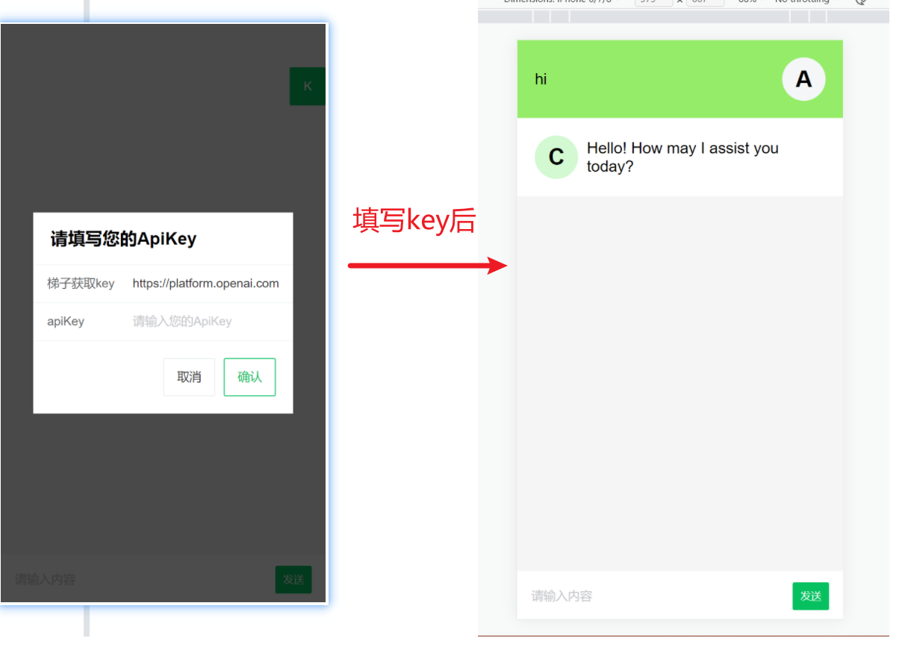
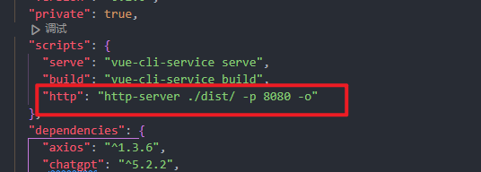

# Simple-chat

> 声明：此项目是基于openAI3.5模型的H5人工智能聊天项目，只发布于 GitHub、Gitee，免费且作为开源学习使用。并且不会有任何形式的卖号、付费服务、讨论群、讨论组等行为。谨防受骗。
>
> **此项目只适配于H5端**，**线上地址：http://47.242.53.5:888/ **
>
> **tip：如果不需要此弹框，则可以直接在env文件内填写`VUE_APP_API_KEY` = `你的caht秘钥`**
>
> 
>
> 

- [Simple-chat](#Simple-chat)
  - [介绍](#介绍)
  - [前置要求](#前置要求)
    - [Node](#node)
    - [yarn](#yarn)
    - [填写密钥](#填写密钥)
  - [安装依赖](#安装依赖)
    - [后端](#后端)
    - [前端](#前端)
  - [测试环境运行](#测试环境运行)
    - [后端服务](#后端服务)
    - [前端网页](#前端网页)
  - [环境变量](#环境变量)
  - [打包上线](#打包上线)
  - [tip](#tip:本地模拟服务器，运行yarn build后的项目)
  - [赞助](#赞助)
  - [联系方式](#联系方式)

## 介绍

支持双模型，提供了两种非官方 `ChatGPT API` 方法

| 方式                             | 免费？ | 可靠性 | 质量     |
| -------------------------------- | ------ | ------ | -------- |
| `ChatGPTAPI(gpt-3.5-turbo-0301)` | 否     | 可靠   | 相对较笨 |

`ChatGPTAPI` 使用 `gpt-3.5-turbo` 通过 `OpenAI` 官方 `API` 调用 `ChatGPT`

警告：

1. 你应该首先使用 `API` 方式
2. 使用 `API` 时，如果网络不通，那是国内被墙了，你需要自建代理，绝对不要使用别人的公开代理，那是危险的（**此项目已通过node.js代理请求openAI接口，理论上说是不需要再次使用代理工具的**）。
3. 把项目发布到公共网络时，只需.env.pro中的 `VUE_APP_API_HOST` 变量，更改为你的公网ip地址，你也应该修改 `index.html` 中的 `title`，防止被关键词搜索到。

环境变量：

全部参数变量请查看或[这里](#环境变量)


## 前置要求

### Node

`node` 需要 `^16 || ^18 || ^19` 版本（`node >= 14` 需要安装 [fetch polyfill](https://github.com/developit/unfetch#usage-as-a-polyfill)），使用 [nvm](https://github.com/nvm-sh/nvm) 可管理本地多个 `node` 版本

```shell
node -v
```

### yarn

如果你没有安装过 `yarn`

```shell
npm install yarn -g
```

### 填写密钥

获取 `Openai Api Key` 并填写本地环境变量 [跳转](#介绍)

```
# .env 文件

# VUE_APP_API_KEY = '你的caht秘钥'

```

## 安装依赖

> 为了简便 `后端开发人员` 的负担，所以并没有采用前端 `workspace` 模式，而是分文件夹存放。

### 后端

进入文件夹 `/service` 运行以下命令

```shell
yarn
```

### 前端

根目录下运行以下命令

```shell
yarn
```

## 测试环境运行

## 环境变量

环境变量分为两个文件：`.env.dev`（开发环境）、`.env.lacal`（生产环境）

`API` 可用：

- `VUE_APP_API_HOST`  ：后台地址（本地默认：http://localhost:3005、线上例子：http://47.242.53.5:3005）
- `VUE_APP_API_KEY `：apiKey秘钥 [(获取 apiKey)](https://platform.openai.com/overview)

### 后端服务

进入文件夹 `/service` 运行以下命令

```shell
yarn start
```

### 前端网页

根目录下运行以下命令

```shell
yarn serve

访问页面：http://localhost:8080/
```


## 打包上线

### [部署项目链接](https://blog.csdn.net/FF_XM/article/details/130502763?csdn_share_tail=%7B%22type%22%3A%22blog%22%2C%22rType%22%3A%22article%22%2C%22rId%22%3A%22130502763%22%2C%22source%22%3A%22FF_XM%22%7D)


#### 前端网页

1、修改根目录下 `.env.port  `文件中的`VUE_APP_API_HOST` 为你的后端公网ip地址

2、根目录下运行以下命令，然后将 `dist` 文件夹内的文件复制到你网站服务的根目录下

[参考信息](https://cn.vitejs.dev/guide/static-deploy.html#building-the-app)

```shell
pnpm build
```


#### tip:本地模拟服务器，运行yarn build后的项目 

```
npm install -g http-server

终端运行：http-server ./dist/ -p 8080 -o

可在packge.json内配置
```



```
配置完后：yarn http 即可
```


## 赞助

如果你觉得这个项目对你有帮助，并且情况允许的话，可以我小小的支持，总之非常感谢支持～


<div style="display: flex; gap: 20px;">
	<div style="text-align: center">
		
		<p>WeChat Pay</p>
	</div>
	<div style="text-align: center">
		
		<p>Alipay</p>
	</div>
</div>


## 联系方式

`WeChat`：`AMING990213`

`QQ`:`1589045865`
